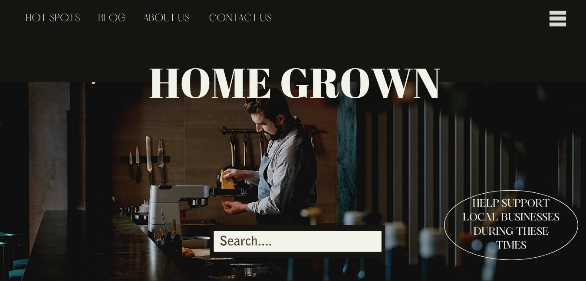

# group_3_project

<h1>Group Name</h1>  - The Creatives 

<h1>Website name</h1> - Home Grown 

<h1>Project Description</h1> - Website to find local businesses in/near your area to help mom and pop shops during the Covid-19 period. 

<h1>APIs</h1> - FourSquare API (basic API for generic info. and premium API for photos, url, phone number), Google Maps API

<h1>Project Mockup</h1> - 

https://www.canva.com/design/DAEQcjbsJfw/xIYaauBCHPYT7aZ6gaNfXA/view?utm_content=DAEQcjbsJfw&utm_campaign=designshare&utm_medium=link&utm_source=publishsharelink

;

Acknowledgements:

1) Eater - content supplied from their website for the blog page
2) Normalize
3) Skeleton 
4) Google Fonts 
5) 

<h1>Team Members and Responsibilities</h1>  - 

<ul>
<li>Satyam - Javascript/Jquery/Ajax/FourSquare API/Google Maps API and Team Lead</li>
<li>Kokhob - HTML/CSS/Design</li>
<li>Terry - HTML/CSS/Design</li>
<li>Yaze - Javascript/Jquery/Fetch/FourSquare API</li>
</ul>

