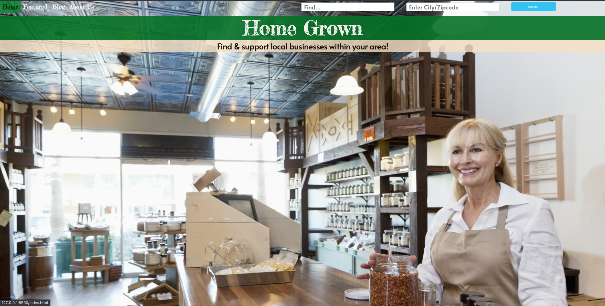
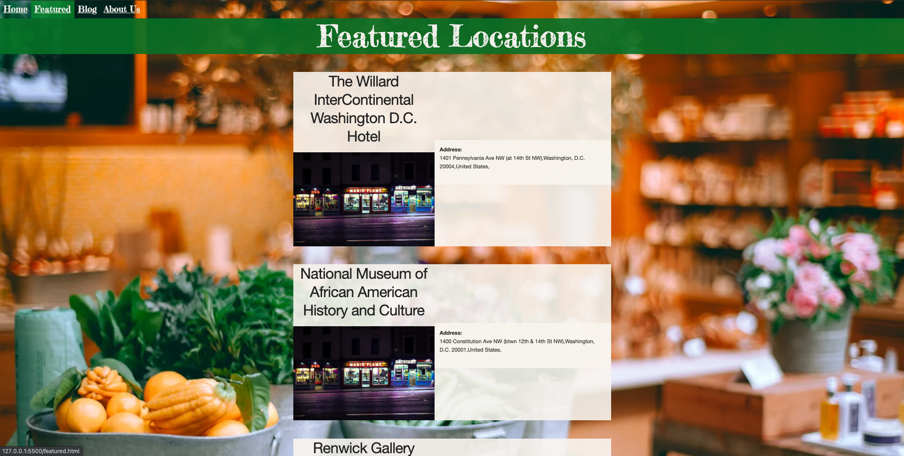
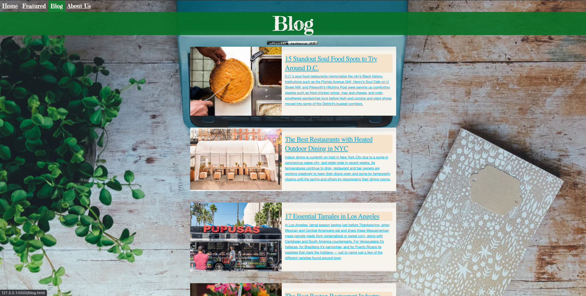
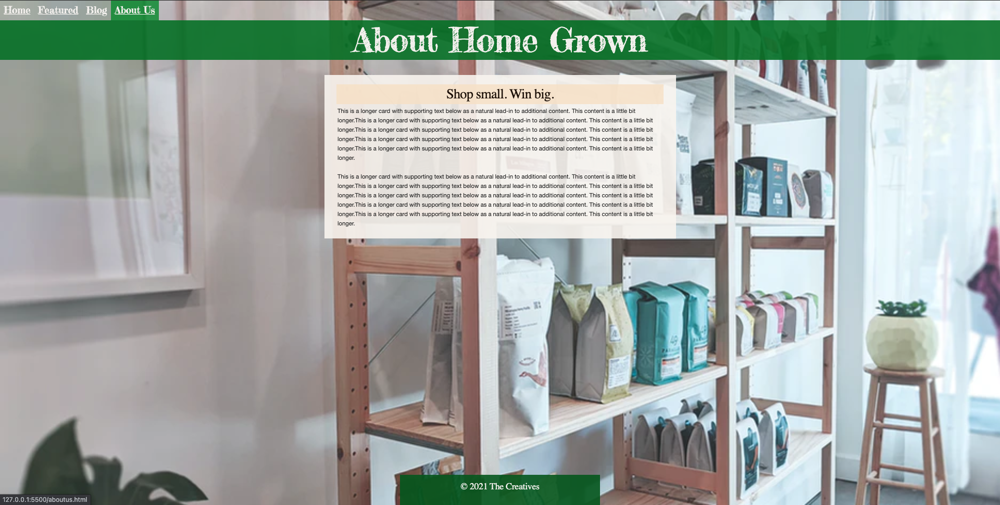

<h1>Group Name</h1>  - The Creatives 

<h1>Website Name</h1> - Home Grown 

<h1>Project Description</h1> - Website to find local businesses near user's area of interest to help mom and pop shops during the Covid-19 period. 

<h1>APIs</h1> - FourSquare API (basic API for generic info. and premium API for photos, url, phone number), Google Maps API (using cluster markers)

<h1>Acknowledgements:</h1> -

1) Eater - Content supplied from their website for the blog page
2) Normalize - Reset stylesheet
3) Skeleton -  Main CSS framework 
4) Google Fonts - Navbar, Header, H2 tag 
5) Favicon - Title Icon (Browser Tab Icon)
6) Saveliy Samoylov - Featured page help
7) Nathan Keeys - Card layout help
8) Ask BCS - Help with questions/doubts

<h1>Team Members and Responsibilities</h1> - 

<ul>
<li>Satyam - Javascript/Jquery/Ajax/FourSquare API/Google Maps API and Team Lead</li>
<li>Kokhob - HTML/CSS/Design</li>
<li>Terry - HTML/CSS/Design</li>
<li>Yaze - Javascript/Jquery/Fetch/FourSquare API</li>
</ul>

<h1> Future Releases </h1> -

<ul>
<li>Provide user the ability to choose the number of results</li>
<li>Update venues on featured.html page every few hours</li>
<li>Add ability to find directions to local venues</li>
<li>Add error modal to inform the user if there are no venues near by</li>
<li>Add weather check functionality for location based on user search</li>
<li>Increase the size of the notifier and make the text bold</li>
<li>Improve layout and design</li>
</ul>

<h1>Application Mockup</h1> - 

https://www.canva.com/design/DAEQcjbsJfw/xIYaauBCHPYT7aZ6gaNfXA/view?utm_content=DAEQcjbsJfw&utm_campaign=designshare&utm_medium=link&utm_source=publishsharelink

 

<h1>Repository and Application URLs</h1> - 

<b>Repo URL:</b> https://github.com/sbharadw/HomeGrown

<b>Application URL:</b> https://sbharadw.github.io/HomeGrown/

